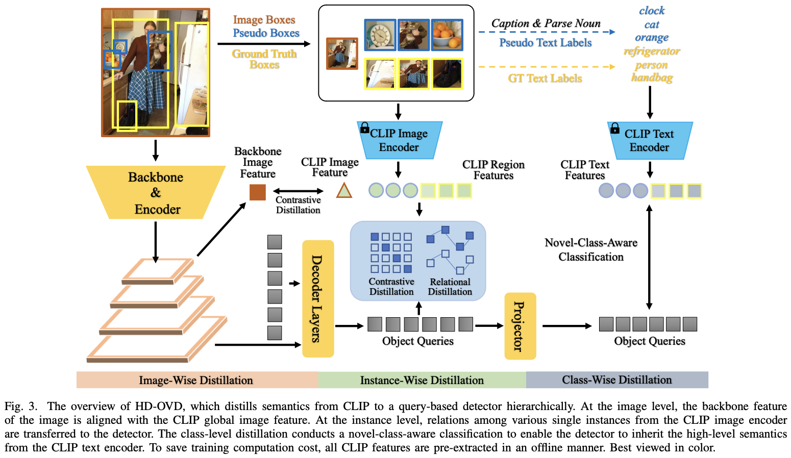

## A Hierarchical Semantic Distillation Framework for Open-Vocabulary Object Detection

This is the official PyTorch implementation of [HD-OVD]() (TMM 2025).



### 1 Introduction

- Open-vocabulary object detection (OVD) aims to detect objects beyond the training annotations, where detectors are usually aligned to a pre-trained vision-language model, eg, CLIP, to inherit its generalizable recognition ability so that detectors can recognize new or novel objects. However, previous works directly align the feature space with CLIP and fail to learn the semantic knowledge effectively. In this work, we propose a hierarchical semantic distillation framework named HD-OVD to construct a comprehensive distillation process, which exploits generalizable knowledge from the CLIP model in three aspects. In the first hierarchy of HD-OVD, the detector learns fine-grained instance-wise semantics from the CLIP image encoder by modeling relations among single objects in the visual space. Besides, we introduce text space novel-class-aware classification to help the detector assimilate the highly generalizable class-wise semantics from the CLIP text encoder, representing the second hierarchy. Lastly, abundant image-wise semantics containing multi-object and their contexts are also distilled by an image-wise contrastive distillation. Benefiting from the elaborated semantic distillation in triple hierarchies, our HD-OVD inherits generalizable recognition ability from CLIP in instance, class, and image levels. Thus, we boost the novel AP on the OV-COCO dataset to 46.4% with a ResNet50 backbone, which outperforms others by a clear margin. We also conduct extensive ablation studies to analyze how each component works.

### 2 Data Preparation

```
|--HD-OVD(code)
|--ovd_resources
    |--coco_proposal_train_object_centric.pkl
    |--coco_proposals_text_embedding10/
    |--coco_detpro_category_embeddings_vit-b-32.pt
    |--obj_detpro_category_embeddings_vit-b-32.pt
|--dataset
    |--coco
        |--annotations
            |--instances_train2017.48.json
            |--instances_val2017.65.min.json
        |--train2017
        |--val2017
```

- Please refer to `tools/get_ov_coco_annotations.py` to build annotations.
- We provide the pre-extracted embeddings in [Huggingface](https://huggingface.co/fushh7/HD-OVD).

### 3 Usage

- Our environment:
  - torch==1.10.1+cu10.2
  - mmcv==1.7.1

- Evaluation (ckpt can be found in [Huggingface](https://huggingface.co/fushh7/HD-OVD), which is slightly lower than the performance in our paper)

```
bash tools/dist_test.sh configs/myovd/ov_coco/myadamixer_r50_1x_coco.py HD_OVD_adamixer.pth 1 50000 --eval=bbox
```

- Training

```
# for adamixer
bash tools/dist_train.sh configs/myovd/ov_coco/myadamixer_r50_1x_coco.py 4 50000

# for faster rcnn
bash tools/dist_train.sh configs/myovd/ov_coco/myfasterrcnn_r50_1x_coco.py 4 50000
```

### 4 License

HD-OVD is released under the Apache 2.0 license. Please see the LICENSE file for more information.

### 5 Bibtex

If you find our work helpful for your research, please consider citing the following BibTeX entry.

```
@article{fu2025hdovd,
  title={A Hierarchical Semantic Distillation Framework for Open-Vocabulary Object Detection},
  author={Fu, Shenghao and Yan, Junkai and Yang, Qize and Wei, Xihan and Xie, Xiaohua and Zheng, Wei-Shi},
  journal={},
  year={2025}
}
```

### 

